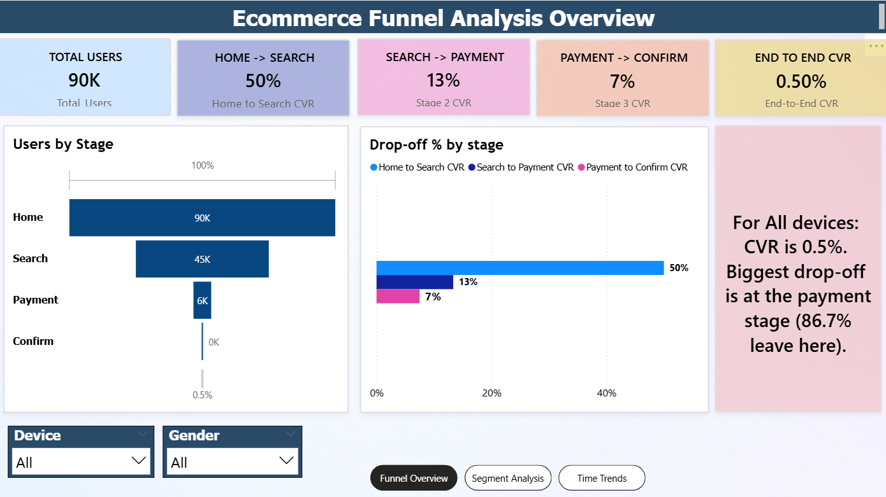
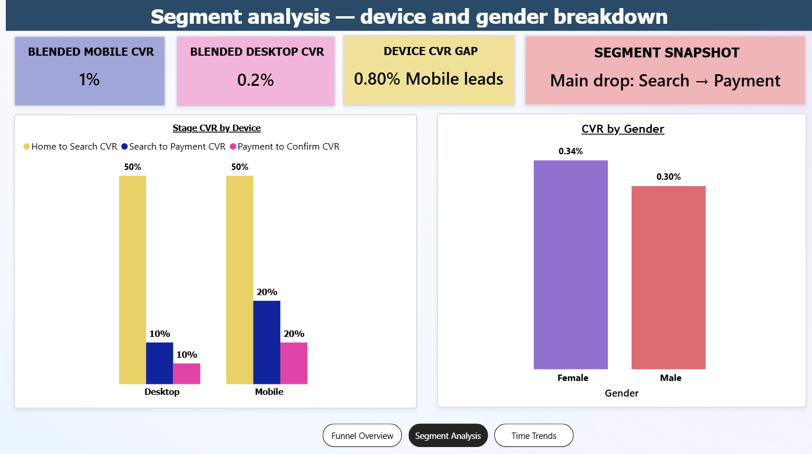
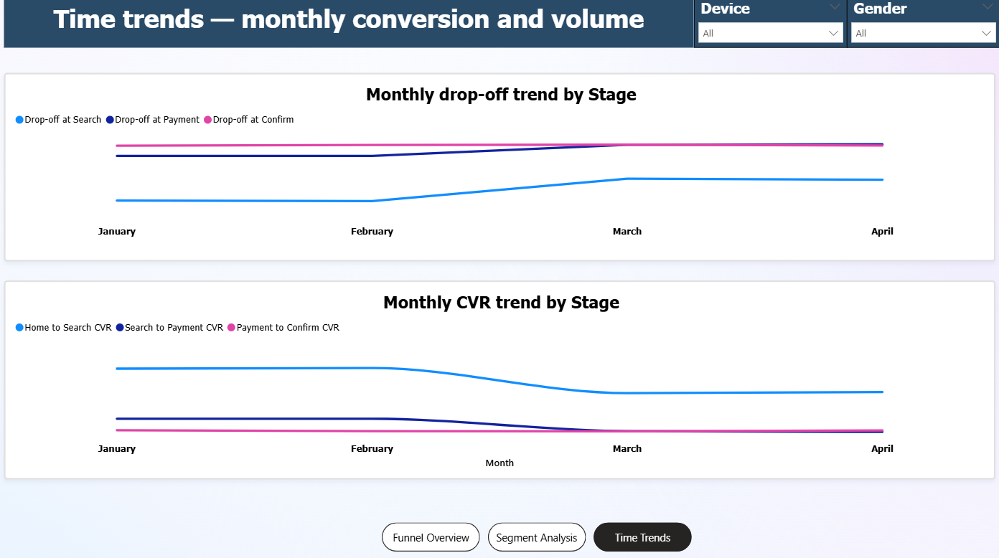
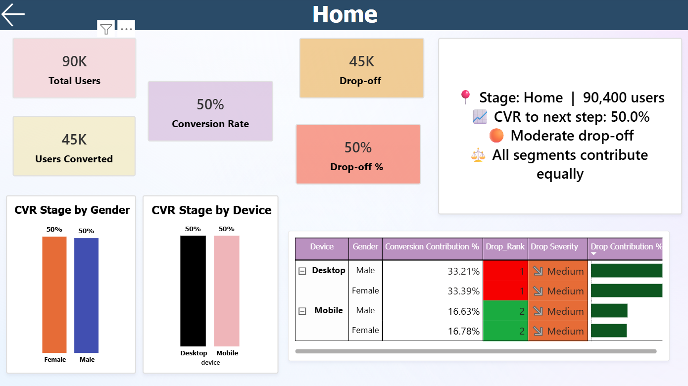
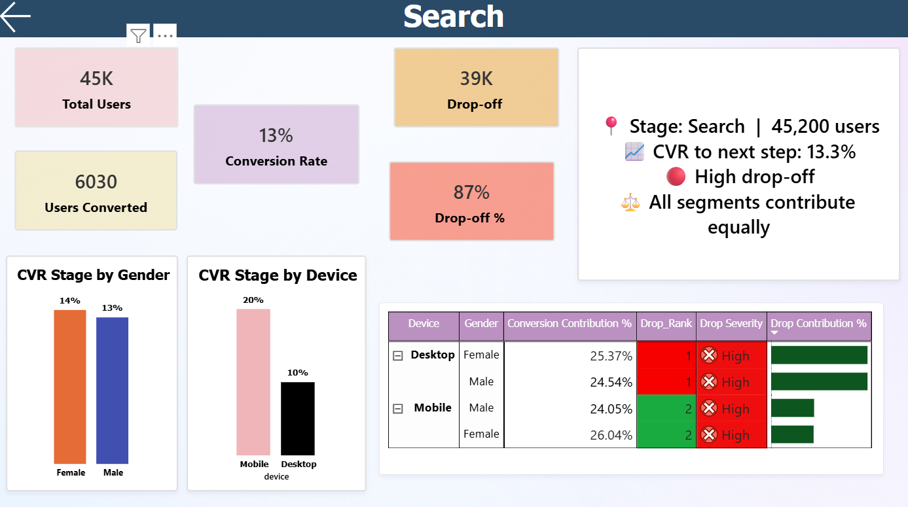
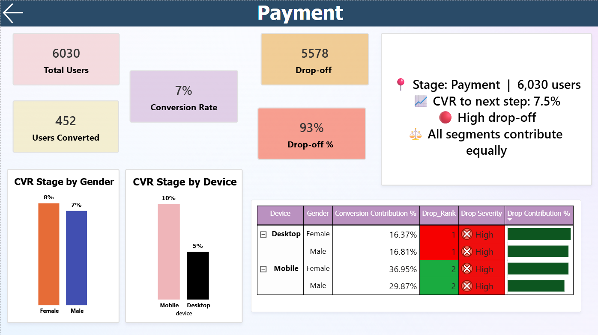
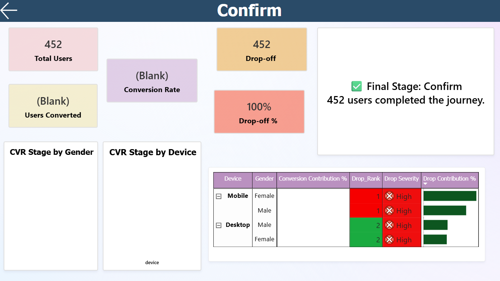

# 📊 E-Commerce Funnel Analysis Dashboard — Power BI

> A comprehensive funnel analysis dashboard built in Power BI to evaluate user behavior across key stages of a digital e-commerce journey — identifying conversion bottlenecks, quantifying drop-offs, and delivering actionable business insights.


---

## 🧠 Project Summary

This case study demonstrates:
- **Strong analytical thinking** — translating raw funnel data into layered business insights
- **Practical DAX & data modeling** — binary stage flags, RANKX, SELECTEDVALUE, dynamic text measures
- **Business decision-making** — prioritized recommendations tied directly to measurable funnel outcomes

---

## 🎯 Business Problem

E-commerce businesses routinely lose revenue at invisible points in their conversion funnel. Without stage-level visibility, optimization is guesswork. This dashboard answers three core questions:

| Question | Answer Provided |
|---|---|
| Where do users drop off? | Stage-by-stage CVR and drop-off % with drill-through |
| Which segment underperforms? | Device × gender breakdown with contribution % and severity |
| Is the problem structural or time-bound? | Monthly trend analysis across all stages (Jan–Apr) |

---

## 📁 Dataset Overview

**Source:** [E-commerce Website Funnel Analysis — Kaggle](https://www.kaggle.com/)

Five CSV tables joined on `user_id`:

| Table | Key Columns | Description |
|---|---|---|
| `home_page_table.csv` | user_id, page | Funnel entry point — all users who visited home |
| `search_page_table.csv` | user_id, page | Users who reached the search/discovery page |
| `payment_page_table.csv` | user_id, page | Users who initiated a transaction |
| `payment_confirmation_table.csv` | user_id, page | Users who completed purchase |
| `user_table.csv` | user_id, date, device, sex | User attributes — primary key for all joins |

---

## 🧱 Data Modeling Approach

- **Binary stage flags** — `visited_home`, `visited_search`, `visited_payment`, `visited_confirm` for clean conditional filtering
- **Funnel progression** — calculated by joining each stage table to `user_table` on `user_id`
- **DAX measures built:** CVR, Drop-off %, Stage Users, Conversion Contribution %, Drop Rank, Drop Severity, Dynamic Insight Text

---

## 📊 Key Results

| Metric | Value |
|---|---|
| Total Users | 90,000 |
| Home → Search CVR | 50% |
| Search → Payment CVR | 13% |
| Payment → Confirm CVR | 7% |
| **End-to-End CVR** | **0.50%** |
| Users who completed journey | 452 |

> 🔴 **Biggest leak:** Search → Payment — 87% of users drop off here

---

## 📄 Dashboard Structure

### 🖥️ Page 1 — Funnel Overview

**Objective:** High-level snapshot of user movement across all four stages.

**Visuals:**
- KPI cards — Total Users, Stage CVRs, End-to-End CVR
- Horizontal bar chart — Users by Stage (90K → 45K → 6K → ~0)
- Drop-off % bar chart — CVR comparison across stages
- Dynamic insight card — device-aware DAX text

**Screenshot:**



---

### 📉 Page 2 — Segment Analysis

**Objective:** Understand how device and gender segments behave across the funnel.

**Visuals:**
- KPI cards — Blended Mobile CVR (1%), Blended Desktop CVR (0.2%), Device CVR Gap, Segment Snapshot
- Clustered bar — Stage CVR by Device (Home→Search, Search→Payment, Payment→Confirm)
- Bar chart — CVR by Gender (Female 0.34% vs Male 0.30%)

**Key Finding:** Desktop users contribute ~66% of conversions. Mobile CVR is near zero — device gap is the dominant optimization lever.

**Screenshot:**



---

### 📈 Page 3 — Time Trend Analysis

**Objective:** Monitor CVR and drop-off trends monthly (January–April) to separate structural from time-bound problems.

**Visuals:**
- Line chart 1 — Monthly drop-off trend by stage (Search, Payment, Confirm)
- Line chart 2 — Monthly CVR trend by stage transition
- Device and Gender slicers

**Key Finding:** Payment and Confirm drop-off converges upward from March — a worsening late-stage retention problem.

**Screenshot:**



---

### 🔍 Drill-through Pages — Stage Deep Dive

**Objective:** Click any stage to navigate to a focused breakdown page with segment-level detail.

**How it works:**
1. Drill-through filter applied on `Stage` field
2. User right-clicks a stage (e.g., Search) → Drill through → Stage Deep Dive
3. Page opens filtered to that stage with full segment breakdown

| Stage | Users | Drop-off | Severity | Top Segment |
|---|---|---|---|---|
| Home | 90,400 | 50% | Medium | All equal |
| Search | 45,200 | 87% | High | Desktop Female (25.37%) |
| Payment | 6,030 | 93% | High | Mobile Female (36.95%) |
| Confirm | 452 | — | Final | Journey complete |

**Screenshots:**

| Home | Search |
|---|---|
|  |  |

| Payment | Confirm |
|---|---|
|  |  |

---

## 🔢 Key DAX Measures

```dax
-- End-to-end conversion rate
End-to-End CVR =
DIVIDE(
    CALCULATE(SUM(funnel_data[Users]), funnel_data[Stage] = "Confirm"),
    CALCULATE(SUM(funnel_data[Users]), funnel_data[Stage] = "Home")
)

-- Segment contribution
Conversion Contribution % =
DIVIDE(
    CALCULATE([Users Converted]),
    CALCULATE([Users Converted], ALL(funnel_data[device], funnel_data[sex]))
)

-- Drop rank by device
Drop_Rank =
RANKX(ALLSELECTED(funnel_data[device]), CALCULATE([Drop Off Users]),, DESC, DENSE)

-- Dynamic insight text (drill-through aware)
Dynamic Insight =
VAR StageName   = SELECTEDVALUE(funnel_data[Stage])
VAR IsLastStage = StageName = "Confirm"
VAR DropLevel   =
    SWITCH(TRUE(),
        [Drop-off % Stage] > 0.6, "🔴 High drop-off",
        [Drop-off % Stage] > 0.4, "🟠 Moderate drop-off",
        "🟢 Low drop-off"
    )
RETURN
    IF(IsLastStage,
        "✅ Final Stage: " & StageName & UNICHAR(10) &
        FORMAT([Stage Users], "#,0") & " users completed the journey.",
        "📍 Stage: " & StageName & "  |  " & FORMAT([Stage Users], "#,0") & " users" & UNICHAR(10) &
        "📈 CVR to next step: " & FORMAT([CVR Stage], "0.0%") & UNICHAR(10) &
        DropLevel
    )
```

> 💡 **Key fix:** `SELECTEDVALUE()` reads the drill-through filter context directly — replacing `ALL()`/`ALLSELECTED()` which were stripping the page-level filter and returning incorrect values.

---

## 🚀 Recommendations

| Priority | Area | Action | Impact |
|---|---|---|---|
| 🔴 1 | Search → Payment | Improve search relevance, add trust signals, stronger CTAs | High |
| 🔴 2 | Mobile UX | Simplify checkout, reduce form fields, improve load speed | High |
| 🟠 3 | Payment → Confirm | Add progress indicators, offer guest checkout | Medium |
| 🟠 4 | March+ trend | Investigate platform/pricing changes causing late-stage convergence | Medium |
| 🟢 5 | Onboarding | A/B test first-session flows to improve new-user CVR | Long-term |

---
<!--
## 🗂️ Repository Structure

```
📦 ecommerce-funnel-analysis
├── 📁 data/
│   ├── home_page_table.csv
│   ├── search_page_table.csv
│   ├── payment_page_table.csv
│   ├── payment_confirmation_table.csv
│   └── user_table.csv
├── 📁 screenshots/
│   ├── funnel_overview.png
│   ├── segment_analysis.png
│   ├── time_trends.png
│   ├── drill_home.png
│   ├── drill_search.png
│   ├── drill_payment.png
│   └── drill_confirm.png
├── 📄 Funnel_Analysis.pbix
├── 📄 Funnel_Dashboard_Report.docx
└── 📄 README.md
```

---
-->
## ⚙️ How to Use

1. Clone this repository
2. Open `Funnel_Analysis.pbix` in Power BI Desktop
3. If prompted, update the data source path to your local `/data/` folder
4. Refresh the data model
5. Navigate pages using the bottom tab buttons
6. Right-click any stage bar to drill through to the Stage Deep Dive page

---

## 🏆 Skills Demonstrated

| Skill | Detail |
|---|---|
| **Advanced DAX** | SELECTEDVALUE, RANKX, SUMMARIZE, TOPN, dynamic text generation |
| **Data Modeling** | Multi-table star schema, binary flags, conditional funnel logic |
| **Visual Design** | Consistent color coding, KPI cards, drill-through navigation |
| **Business Insight** | Recommendations prioritized by measurable revenue impact |

---

## 📬 Contact

If you found this project useful or have feedback, feel free to connect!

⭐ **Star this repo** if it helped you build your own funnel analysis dashboard.
